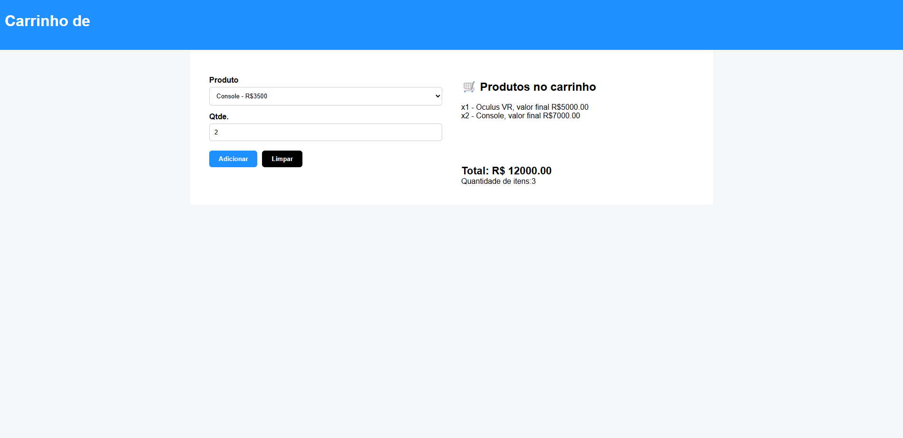

🚀 Sorteador de números

Projeto de sistema de carrinho de compras que permite adicionar, remover e gerenciar produtos antes de finalizar a compra. desenvolvido durante meus estudos na plataforma Alura, com o objetivo de praticar JavaScript, lógica de programação e manipulação do DOM.

📸 Preview

🔗 Demo online

https://tgusbc.github.io/Carrinho-de-compras/

🛠️ Tecnologias utilizadas

HTML5

CSS3

JavaScript